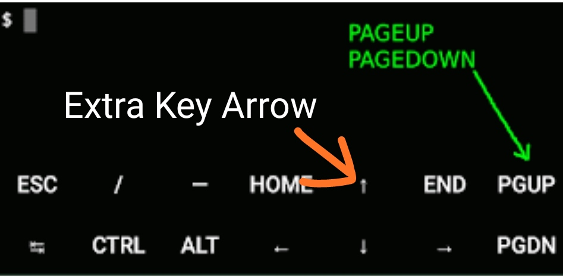
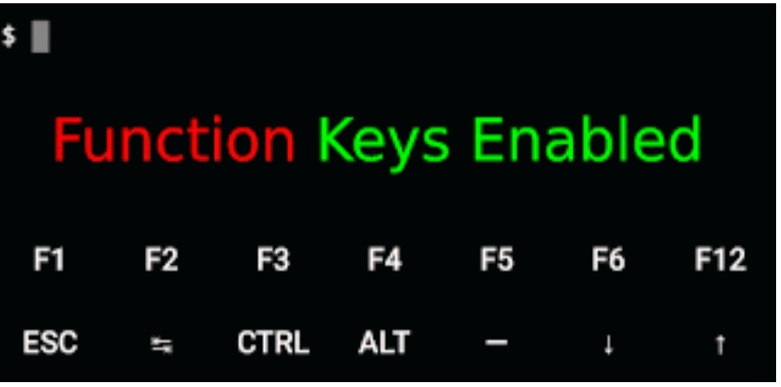

# T-KEYBOARD
 
https://img.shields.io/badge/MARMU-BABY_DRAG0N-orange?style=for-the-badge&logoColor=pink&labelColor=black

⭐ pkg update -y

⭐ pkg upgrade-y

⭐ pkg install git -y

⭐ pkg install toilet && pkg install figlet

⭐ pkg install ruby curl wget

⭐ git clone https://github.com/MarMu-BabyDragon/T-KEYBOARD

⭐ cd T-KEYBOARD

⭐ chmod +x *

⭐ bash keyboard.sh

# If You Want To Use This Extra Key? Select 👉 S1
 

# If You Want To Use This Extra Key? Select 👉 S2
 

